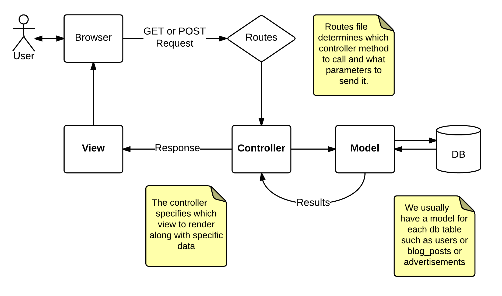

Ad Lister Project
=================

Congratulations! You've just gotten your first web development job. Ad
Lister LLC had originally hired an Elbonian subcontractor to build their
Craigslist clone but the project was never finished. Now they've hired
you and another junior developer or two (your classmates) to come in and
finish the project.

You'll need all of the topics you've learned so far in class including
HTML, CSS, JavaScript, and PHP. You will be working on this project in
teams of two to three.

Project Goals
-------------

1.  Gain experience in building a well-designed, vanilla PHP site using
    an Model, View, Controller (MVC) paradigm.
2.  Learn how to use Git in a team environment.
3.  Test your resourcefulness in solving problems.

Schematic Diagram of Model, View, Controller (MVC) paradigm:


Project Tasks Outline
---------------------

-   Clone the repo and familiarize yourself with the existing code
-   Get the site up and running
-   Figure out the database structure
-   Build out the views
-   Build out the backend for ads
-   Implement user authentication

The first two tasks will need to be performed in order, but after that
it is up to your team how you want to proceed.

Clone the existing site
-----------------------

Get together with your team mates and create an organization on Github
to work from. Once the organization is made and all the group members
are added, you should fork this repo to your organization, then clone
this repository down to your machine.

``` {.bash}
git clone git@github.com/<your-organization>/adlister.dev ~/vagrant-lamp/sites/adlister.dev
```

It looks like the Elbonians have already set up most of the files you'll
need. Explore the files that are already there and look at what still
needs to be completed. Some items in the file tree below are existing in
the cloned repository and some can be copied from previous class
exercises.

``` {.example}
adlister.dev
├── README.md
├── bootstrap.php
├── controllers
│   └── PageController.php
├── database
│   ├── db_connect.php
│   ├── migrations
│   │   └── user_migration.php
│   └── seeds
│       └── user_seeder.php
├── env.template.php
├── models
│   ├── Model.php
│   └── User.php
├── mvc-diagram.png
├── public
│   ├── css
│   │   └── main.css
│   └── index.php
├── utils
│   ├── Auth.php
│   ├── Input.php
│   └── helper_functions.php
├── views
│   ├── 404.php
│   ├── ads
│   │   ├── create.php
│   │   ├── edit.php
│   │   ├── index.php
│   │   └── show.php
│   ├── home.php
│   ├── partials
│   │   ├── common_js.php
│   │   ├── head.php
│   │   └── navbar.php
│   └── users
│       ├── account.php
│       ├── edit.php
│       ├── login.php
│       └── signup.php
└── wireframes.pdf

12 directories, 29 files
```

The `README.md`, `wireframes.pdf`, and `mvc-diiagram.png` files are
provided just for instruction, and are not part of the project.

Get the site up and running
---------------------------

After cloning the code, you'll need to setup your development
environment for this project. Make sure you setup both a site and a
database for the project.

When you first visit the site, you'll notice some errors. Your next task
is to figure out what is causing those errors and fix them. Part of this
task will be to configure your application to talk to your database. The
Elbonians were kind enough to leave us a `env.template.php` file that
describes what configuration needs to be present. The application tries
to load the configuration from a `.env.php` file (you'll notice this
file is untracked in git because it contains sensitve information, like
datbase credentials), so make a copy of `env.template.php` named
`.env.php` and fill it in with your configuration.

After you fix the existing errors, you should see a 404 page. Next, you
should take a look in the page controller and define a route for your
home page. Look at the existing code to see how you can do this.

From here, you should be able to define more routes that include their
relevant views.

Figure out the datbase structure
--------------------------------

Good news! The Elbonians built a database migration for your users
table. Think about how you'll map out the rest of the database. You will
need to create an an `ads` table (and possibly other tables). Make sure
the ads table and the users table are related.

Sketch out a UML-style map of the database, tables, and models before
you begin coding.

Create the database tables with php migration files. Take a look at the
existing user migration to see how to go about this.

*Remember to use prepared statements!*

Buildout the views
------------------

1.  Build views for your site according to the wireframes provided. Once
    complete, break down the template into a header, footer, navbar, etc
    and populate the PHP files in the views/partials directory
    accordingly.
2.  Begin adding content to the `public/index.php` file and include your
    partial views to make your PHP site look like your HTML mockup. Make
    sure to put any site resources (JS, images, and CSS) in the
    appropriate locations.
3.  Continue building out your site with HTML so that you have views for
    viewing all the ads, viewing an individual ad, creating an ad, and
    editing an ad. You should also build out similiar views for users.
4.  At this point, you should hard-code sample data and use php to
    display them in the HTML (eventually this data will be coming from
    the datbase, and won't be hardcoded). For example, in the
    ads.index.php file, you should have a listing of 3-5 hard-coded
    sample ads.
5.  Add links between the php files in public directory so that you can
    navigate from page to page.

Create the backend for Ads
--------------------------

### Model

You will need to create a Model for ads. To do this, you should extend
the existing `Model` class. Your Ad model will be a class that inherits
from the Model that provides much of the reusable functionality.

You should test out the ad model by creating a seeder for ads, similiar
to the existing seeder for users. You could also create a small php
script to run from the command line to test this functionality.

### Controller

Now you will need a way for the data from the database to make its way
into the view. Your controller should respond to various routes for ads
and pass the relevant information to the corresponding view.

Build out the following routes for your application:

    Request Method | Route | Description
    GET | /ads | View all the ads
    GET | /ads?id={n} | View an individual ad (where `{n}` is the database id of the ad)
    GET | /ads/create | View the form for creating an ad
    GET | /ads/edit?id={n} | View the form for editing an individual ad
    POST | /ads/create | Create an ad
    POST | /ads/edit?id={n} | update an existing ad

Implement User Login
--------------------

Create a route for `/login` and allow users to login to the application.
Make sure your application meets the following requirements:

1.  Only authenticated users can create ads.
2.  Newly created ads are tied to the user that created them.
3.  Ads can only be edited by the user that created them.

You should be able to use your Auth helper class created in previous
exercises along with the provided User model to help with these tasks.

Where to go from here...
------------------------

So many places! If you have time, try one of the following (or invent
your own!):

-   Implement delete functionality for ads.
-   Implement image upload for ads (there is an existing helper function
    for this)
-   Allow a user to edit their profile, update their password, etc.
-   Allow users to delete ads that they have created.
-   Implement a user dashboard view where they will have quick access to
-   all their ads.
-   Use composer to pull in a third party libraries for things like
-   email (SwiftMailer), generating fake data (Faker), or any other
-   feature you may want.
-   Send emails on important events like user signup.
-   Allow users to mark their "favorite" ads and make these show up on
-   the dashboard.
-   Implement a "flagging" feature where users can mark ads as
-   inappropriate.
-   Implement an admin user that can moderate ads and remove them.
-   Implement a user feedback system.
-   Implement a forgot-password feature.
-   One nice feature for a user of the Ad Lister app would be to create
    some ads in a CSV and then do a bulk upload.
-   Be creative, and most of all have fun!

